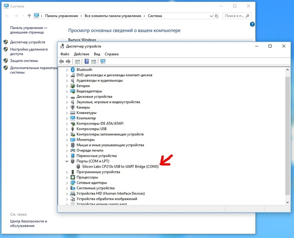
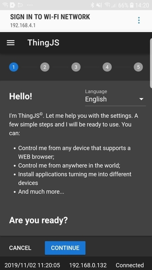
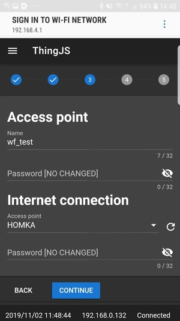
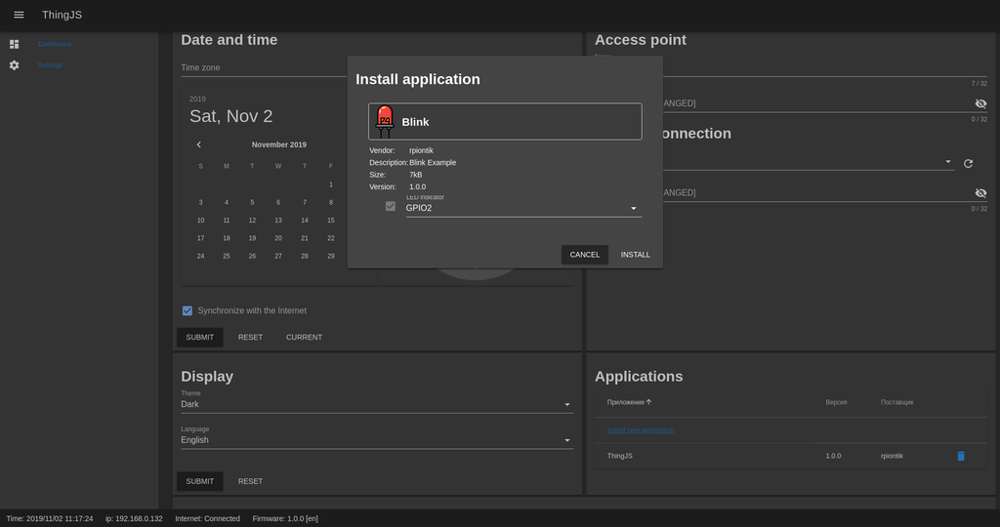

# Overview
The repository is user packet of ThingJS open source IoT platform. It contains ready to use firmware and applications.

# Deploy

## Linux
1. Connect ESP32 to USB port
2. Check available device /dev/ttyUSB0
3. Run flash.sh
``` bash
git clone https://github.com/rpiontik/ThingJS-user-packet
cd ThingJS-user-packet
./flash.sh

```

## Windows
1. Connect ESP32 to USB port
2. Find virtual COM port of connection and run flash.bat 



``` bash
git clone https://github.com/rpiontik/ThingJS-user-packet
cd ThingJS-user-packet
./flash.bat COM3
```

# Use
1. Connect your device to WiFi of ThingJS device (wf_test) with password 12345678
2. For smartphone you will redirected to captive portal. For other devices need to open http://192.168.4.1 in a browser
3. Helper will help you to configure the device
4. When device will connected, in footer will show IP of device in intranet You can use the device by intranet use this IP.

 


# Install ThingJS application
1. Open http://[IP of device] in a browser
2. Go to Settings -> Internet connection -> Applications
3. Click on Install new application
4. Select application from apps folder (for example blink.smt)
5. Select GPIO (if require) that the application will be use
6. Click Install



# Applications
1. [Blink](docs/BLINK.md) - Simplest application to blink an LED.
2. [Clock](docs/CLOCK.md) - Application to show system time by UBUS.
3. [ds18x20](docs/DS18X20.md) - Application to use OneWire bus and show temperature from sensors.
4. [http](docs/HTTP.md) - HTTP/HTTPS request demonstrator.
5. [mqtt](docs/MQTT.md) - The application demonstrates integration via MQTT protocol.
6. [thermostat](docs/THERMOSTAT.md) - Climate control application.

# Licensing
ThingsJS is released under
[GNU GPL v.2](http://www.gnu.org/licenses/old-licenses/gpl-2.0.html)
open source license.
