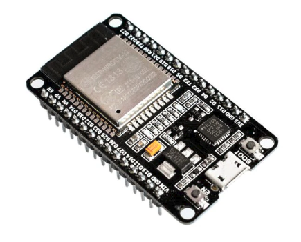

# Overview
Simplest application to blink a LED.

# Description

You can to test ThingJS by simplest task - LED blink. For test you need hardware: 

# Hardware

* ESP32 NodeMCU
 

Some NodeMCU has LED on board. Typical solution - LED indicator on GPIO2. 
Ask seller regarding it. If it is, then you don't need anything else. Device is ready to use. 
Otherwise, you need:

* LED 3V and resistor 1K

You can buy any items on [aliexpress](https://aliexpress.ru/wholesale?catId=0&initiative_id=SB_20200922095325&SearchText=ESP32+Nodemcu).

# Use
1. Install application Blink;
2. Run application;
3. Control blinking with a checkbox "Blink state".

 

# Licensing
ThingsJS is released under
[GNU GPL v.2](http://www.gnu.org/licenses/old-licenses/gpl-2.0.html)
open source license.
