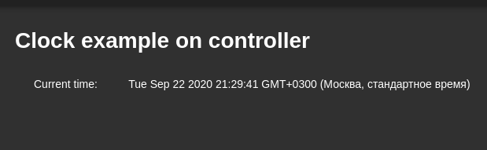

# Overview
Application to show system time by UBUS.

# Description

You can see chip's internal the time. The time is delivering from chip to frontend by UBUS.  

# Hardware
* ESP32 NodeMCU
 

You can buy any item on [aliexpress](https://aliexpress.ru/wholesale?catId=0&initiative_id=SB_20200922095325&SearchText=ESP32+Nodemcu).

# Use
1. Install application Clock;
2. Run application.

 

# Licensing
ThingsJS is released under
[GNU GPL v.2](http://www.gnu.org/licenses/old-licenses/gpl-2.0.html)
open source license.
