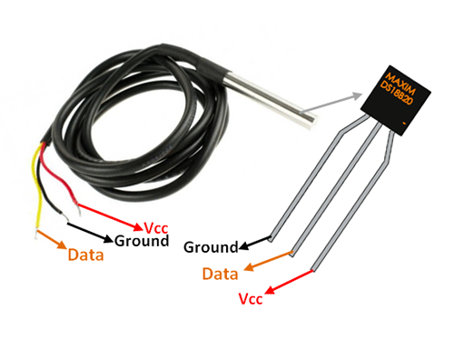

# Overview
Application to use OneWire bus and show temperature from sensors.

# Description
Once a second, the application receives information from temperature sensor and
demonstrates it to you. Sensor used ds18b20 on OneWire bus.

# Hardware
* ESP32 NodeMCU
 

* DS18B20 sensor 

Connection diagram

You can replace the diode 1N4148 with any compatible one.

You can buy any item on [aliexpress](https://aliexpress.ru/wholesale?catId=0&initiative_id=SB_20200922095325&SearchText=ESP32+Nodemcu).

# Use
1. Install application Clock;
2. Run application;
3. After a few seconds, the application will show a report.

# Licensing
ThingsJS is released under
[GNU GPL v.2](http://www.gnu.org/licenses/old-licenses/gpl-2.0.html)
open source license.
