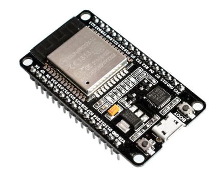
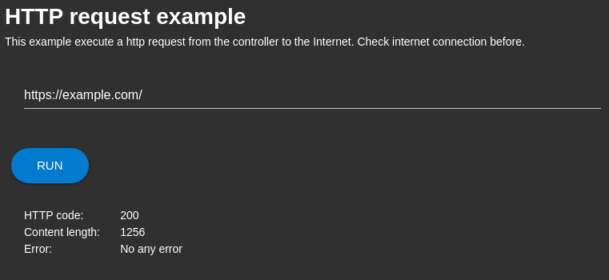

# Overview
HTTP/HTTPS request demonstrator.

# Description

The application demonstrates the use of HTTP/HTTPS requests from chip.  

# Hardware
* ESP32 NodeMCU
 

You can buy any item on [aliexpress](https://aliexpress.ru/wholesale?catId=0&initiative_id=SB_20200922095325&SearchText=ESP32+Nodemcu).

# Use
1. Install application;
2. Run application;
3. Enter http/https website url;
3. Click "Run".

After a few seconds, the application will show a report on the completed request. 

 

# Licensing
ThingsJS is released under
[GNU GPL v.2](http://www.gnu.org/licenses/old-licenses/gpl-2.0.html)
open source license.
