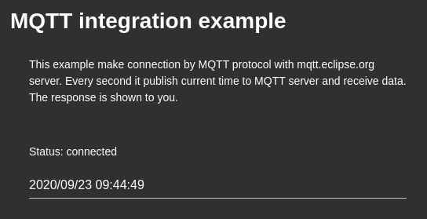

# Overview
The application demonstrates integration via MQTT protocol

# Description
The internal time of the chip is sending to and receiving from the MQTT broker.
You can see result on screen.  

# Hardware
* ESP32 NodeMCU
 

You can buy any item on [aliexpress](https://aliexpress.ru/wholesale?catId=0&initiative_id=SB_20200922095325&SearchText=ESP32+Nodemcu).

# Use
1. Install application Clock;
2. Run application.

# Licensing
ThingsJS is released under
[GNU GPL v.2](http://www.gnu.org/licenses/old-licenses/gpl-2.0.html)
open source license.
