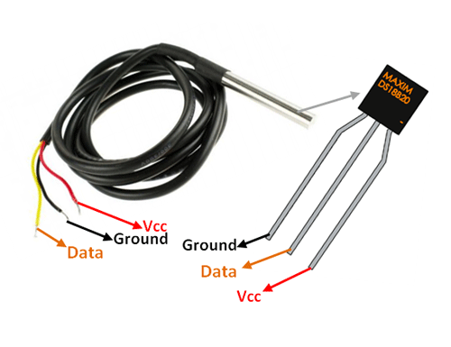
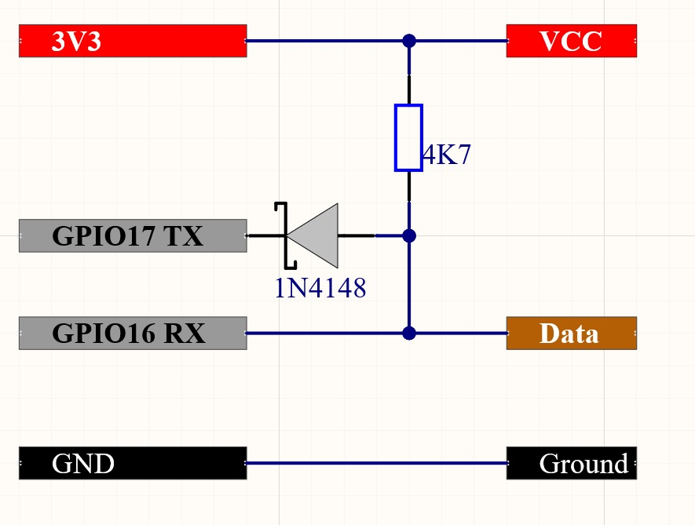
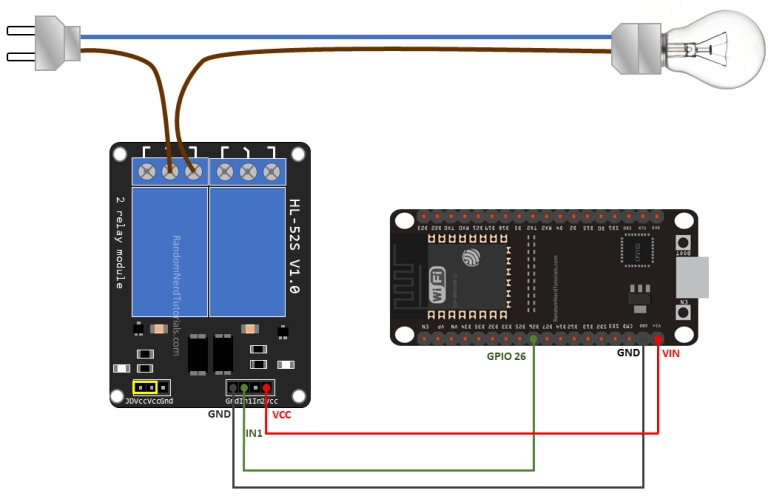
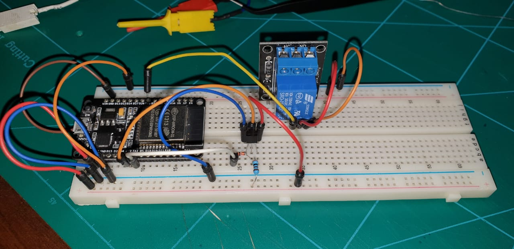
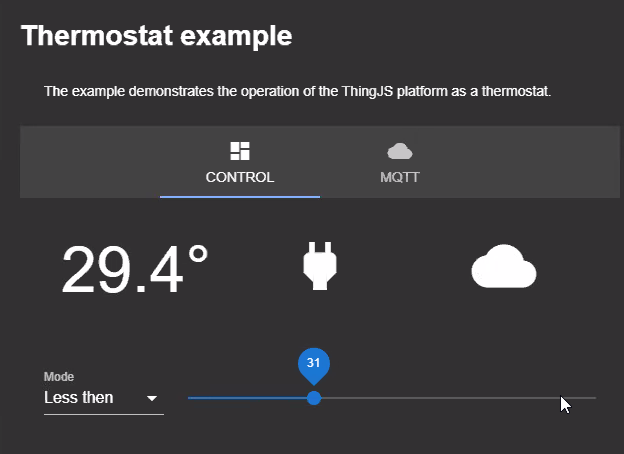
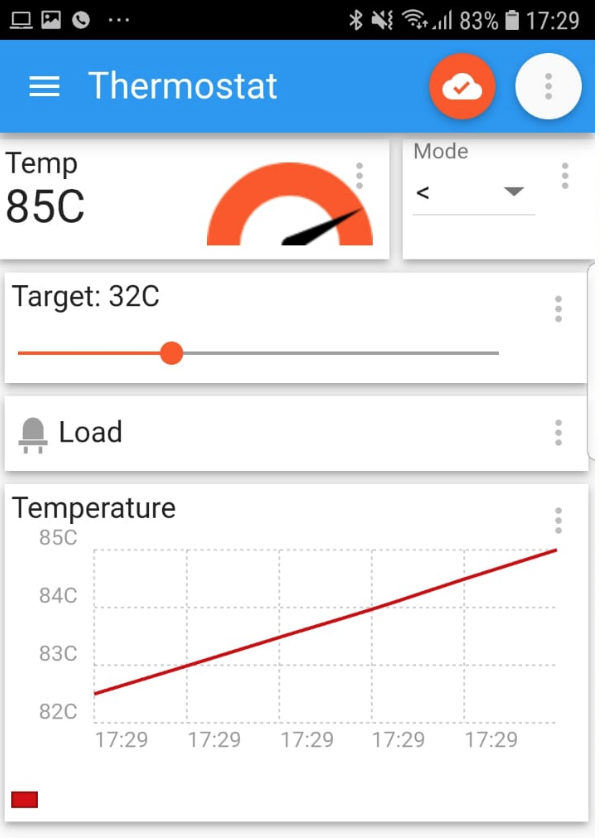

# Overview
Climate control application.

# Description
This application measures room temperature. Temperature set points are seting by a slider. 
Depending on the mode of operation, the load can be switched on for cooling or heating. 
You can switch mode of the thermostat by choicing value of the dropbox. Forced modes of operation 
are available to you - on/off.

You can also control the app remotely. To do this, use the tab "MQTT". Install the mobile 
application on your phone and set up a connection to the device.

# Hardware
* ESP32 NodeMCU
 

* DS18B20 sensor 

Connection diagram DS18B20

You can replace the diode 1N4148 with any compatible one.

* Relay 5V

You can buy any item on [aliexpress](https://aliexpress.ru/wholesale?catId=0&initiative_id=SB_20200922095325&SearchText=ESP32+Nodemcu).

# Use
1. Install application;
2. Run application;
3. After a few seconds, the application will show a report of state;
4. You can control device by choose the mode and target temperature.

Indicators:
1. Current temperature;
2. Load status (on/off);
3. Cloud connection. 

# Cloud connection (MQTT)
1. Install any MQTT console application on your phone. Recommend:
    * [MQTT Dash (RUS)](https://play.google.com/store/apps/details?id=net.routix.mqttdash)
    * [IoT MQTT Panel (EN)](https://play.google.com/store/apps/details?id=snr.lab.iotmqttpanel.prod)
    * You can choose any other application. 
2. Configure mobile application using tab "MQTT"
    * Add new connection;
    * Enter server address and port (no ssl, no wss and etc);
    * Add widgets for control the device.

# Licensing
ThingsJS is released under
[GNU GPL v.2](http://www.gnu.org/licenses/old-licenses/gpl-2.0.html)
open source license.
